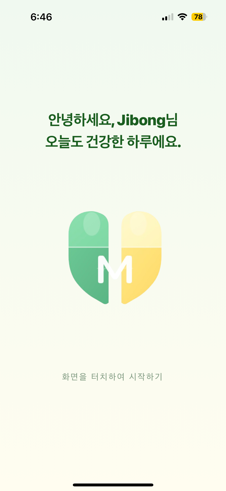
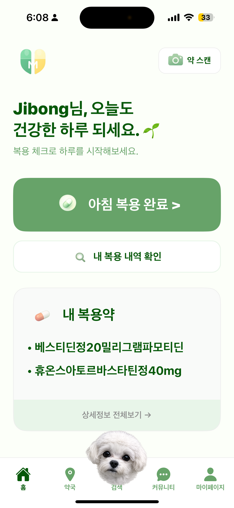
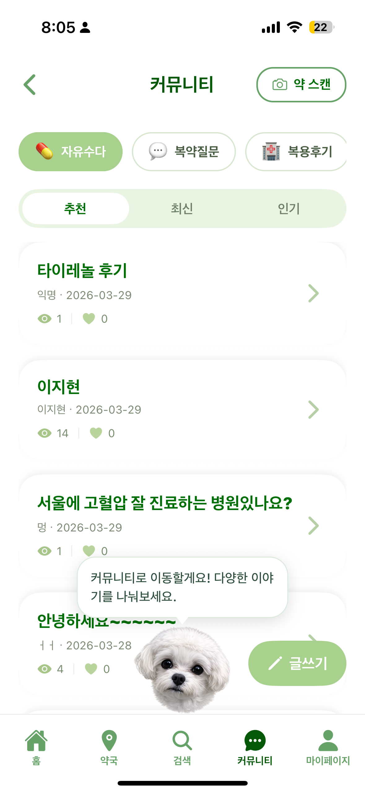
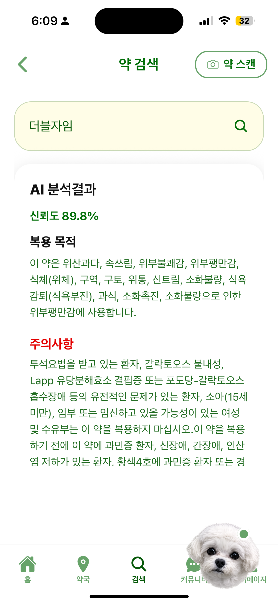
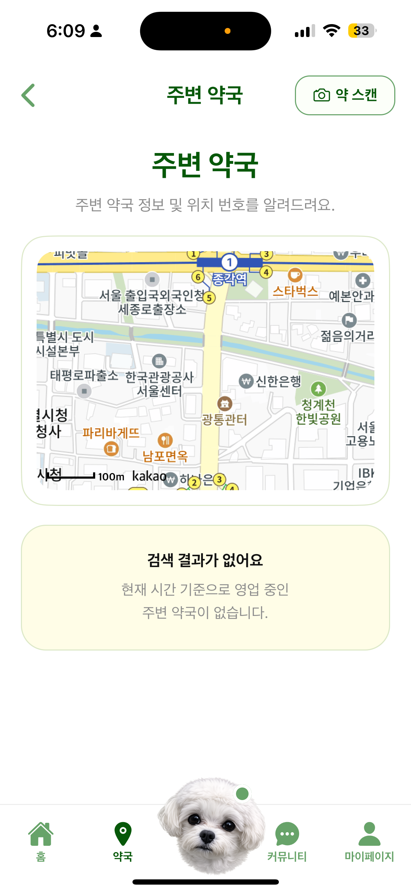

# 💊 MEDI — AI 복약 관리 에이전트 앱
> **"매디"라고 부르면, 복약부터 약 정보까지 음성으로 해결하는 AI 복약 관리 서비스**

<p align="center">
  
  
  
  
  
</p>
<p align="center">
  <i>홈 · 음성 대화 · 약 스캔 · 약국 지도</i>
</p>


> 🏆 **Microsoft AI Engineer 3기 파이널프로젝트 우수상** | Android 배포 완료

---

## 📝 프로젝트 개요 (Overview)

만성질환자 복약 불이행률 50% 이상. 기존 알람 앱은 울리기만 하고 실제 복약 여부를 알 수 없다.

**MEDI**는 "약 먹었어"라는 말 한 마디가 텍스트 응답으로 끝나지 않고, DB 기록 · 알람 변경 · 화면 이동까지 실제 동작으로 이어지는 AI Agent 기반 복약 관리 앱이다. "매디" 호출어로 상시 음성 인터페이스를 활성화하고, IoT 약통 무게 센서와 연동해 복약 여부를 자동 감지한다.

- **개발 기간**: 2026.01 ~ 2026.03
- **배포 상태**: iOS · Android 빌드 완료 | Android 배포 완료 (App Service → 서버리스 이전 중)
- **연계 레포**: [MEDI Agent Server →](https://github.com/lifeiscabaret/MEDIE-AI-Agent)

---

## 🏆 핵심 성과 (Key Achievements)

| 항목 | 내용 |
|------|------|
| 수상 | Microsoft AI Engineer 3기 파이널프로젝트 **우수상** |
| 배포 | iOS · Android 빌드 완료, **Android 배포 완료** |
| 약 스캔 | RAG 기반 AI 분석결과 신뢰도 **89.8%** |
| UX | 음성 명령으로 화면 이동 · 알람 설정 · 복약 완료까지 **앱 전체 제어** |
| 안정성 | TTS Fallback으로 ElevenLabs 장애 시 **음성 응답 무중단** 보장 |

---

## ✨ 핵심 기능 (Core Features)

### 🎙️ 1. 호출어 기반 상시 음성 인터페이스
앱 실행과 동시에 마이크를 상시 활성화. "매디" 호출어 감지 후 대화를 시작한다.

- TTS 응답 완료 후 STT 자동 재시작 — **연속 대화 루프** 구현
- 발화 중 **1500ms 디바운스**로 말 끊김 없이 자연스러운 턴 전환
- `isSpeakingRef` 상태머신으로 TTS 재생 구간 STT 완전 차단
- ElevenLabs TTS 실패 시 **expo Speech 자동 전환**, 음성 응답 무중단 보장

### 🤖 2. AI Agent 응답 기반 앱 직접 제어
Agent가 반환하는 구조화된 신호(`reply · command · target · params`)로 앱 전체를 제어한다.

```
Agent 응답 예시
{
  "reply": "복용 완료로 기록했어요! 😊",
  "command": "COMPLETE_DOSE",
  "target": "NONE",
  "params": { "taken_at": "2026-03-15 08:32:00" }
}
```

| command | 앱 동작 |
|---------|---------|
| `NAVIGATE` | 지정 화면으로 이동 |
| `COMPLETE_DOSE` | 복약 완료 DB 기록 |
| `SET_ALARM` | 알람 시간 변경 |
| `TOGGLE_ALL_ALARMS` | 전체 알람 켜기/끄기 |
| `SEARCH_DRUG` | 약 검색 화면 이동 + 키워드 주입 |
| `WRITE_POST` | 게시글 초안 자동 작성 후 화면 이동 |
| `SHOW_CONFIRMATION` | 복약 확인 팝업 표시 |

### 💡 3. 복약 패턴 분석 → 알람 자동 제안
최근 5회 복약 시간 평균을 계산해 알람 변경을 자동 제안한다. 사용자 확인 시 앱 · 하드웨어 알람을 동시에 업데이트한다.

### 🔔 4. IoT 연동 + Expo Push 알림
Arduino 무게 센서 감지 → Agent → **Expo Push API**로 보호자에게 실시간 알림 전송.

---

## 🏗 앱 아키텍처 (App Architecture)

```
사용자 발화 / "매디" 호출어
        │
        ▼
   STT 인식
   (Android: ko / iOS: ko-KR)
   interimResults: true — 실시간 수신
        │ 1500ms 디바운스
        ▼
   isSpeakingRef 상태 확인
   (TTS 재생 중이면 STT 차단)
        │
        ▼
   FastAPI Agent Server 호출
   POST /chat
        │
        ▼
   응답 파싱 (reply · command · target · params)
        │
        ├─── reply → ElevenLabs TTS 음성 재생
        │           (실패 시 expo Speech fallback)
        │
        ├─── command → 앱 기능 실행
        │           (복약 완료 / 알람 설정 / 팝업 등)
        │
        └─── target → React Navigation 화면 이동

IoT 이벤트 (별도 채널)
Arduino 무게 감지 → MQTT → Agent → Expo Push API → 앱 팝업
```

---

## 📱 화면 구성 (Screens)

| 화면 | Route | 설명 |
|------|-------|------|
| 홈 | `HOME` | 오늘 복약 현황 · 매디 음성 인터페이스 |
| 약 스캔 | `SCAN` | 카메라 촬영 → RAG 검색 → AI 분석 |
| 내 약 목록 | `MY_PILL` | 등록된 복약 스케줄 관리 |
| 약국 지도 | `MAP` | 주변 약국 위치 탐색 |
| 알람 설정 | `ALARM` | 복약 알람 시간 · 켜기/끄기 |
| 복용 내역 | `HISTORY` | 복약 이력 조회 |
| 약 검색 | `SEARCH_PILL` | 약 이름 검색 · AI 정보 제공 |
| 커뮤니티 | `COMMUNITY` | 복약 후기 · 질문 게시판 |
| 마이페이지 | `MY_PAGE` | 계정 설정 · 프로필 |

---

## ⚙️ 기술 스택 (Tech Stack)

| 분류 | 기술 |
|------|------|
| Framework | React Native · Expo |
| Language | TypeScript |
| 음성 입력 | expo-speech-recognition (STT) |
| 음성 출력 | ElevenLabs TTS API · expo-speech (fallback) |
| 푸시 알림 | Expo Push Notifications API |
| 로컬 DB | SQLite |
| 네비게이션 | React Navigation |
| 빌드 | Xcode (iOS) · Android Studio |
| 백엔드 연동 | FastAPI REST API |

---

## 🔥 핵심 트러블슈팅 (Troubleshooting)

### 1️⃣ 한국어 STT 플랫폼별 인식 불일치

**문제**: Android · iOS 동일 코드에서 한국어 인식 실패 발생.

**원인**: 플랫폼별 언어코드 형식 상이.
- Android: `ko`
- iOS: `ko-KR`

**해결**: `Platform.OS` 분기로 언어코드 동적 설정. `interimResults: true`로 실시간 수신 안정화.

```typescript
const language = Platform.OS === 'ios' ? 'ko-KR' : 'ko';
```

---

### 2️⃣ TTS 재생 중 STT 충돌 — 대화 루프 오작동

**문제**: 매디 음성(TTS)이 STT에 그대로 입력되어 대화 루프 오작동.

**원인**: TTS 재생 상태와 STT 활성화 간 동기화 로직 없음.

**해결**: `isSpeakingRef` 상태머신으로 TTS 재생 구간 STT 완전 차단. TTS 완료 후 800ms 딜레이 후 STT 재시작.

```typescript
const isSpeakingRef = useRef(false);

// TTS 시작 시
isSpeakingRef.current = true;
await Speech.speak(text, {
  onDone: () => {
    setTimeout(() => {
      isSpeakingRef.current = false;
      restartSTT();
    }, 800);
  }
});

// STT 입력 수신 시
if (isSpeakingRef.current) return; // TTS 중이면 무시
```

---

### 3️⃣ IoT 이벤트 중복 감지 — 팝업 중복 발생

**문제**: 동일 복약 이벤트가 여러 번 감지되어 확인 팝업이 중복 표시.

**원인**: Blob Storage 30초 폴링 시 이미 처리한 타임스탬프를 구분하는 로직 없음.

**해결**: `last_confirmed_timestamp` 기반 중복 방지 로직 추가. 동일 타임스탬프 이벤트는 무시.

---

### 4️⃣ TTS Fallback — ElevenLabs 장애 대응

**문제**: ElevenLabs API 장애 시 음성 응답 전체 중단.

**해결**: ElevenLabs 호출 실패 시 `expo-speech`로 자동 전환. 음성 응답 무중단 보장.

```typescript
try {
  await playElevenLabsTTS(text);
} catch {
  await Expo.Speech.speak(text, { language: 'ko' });
}
```

---

## 📁 프로젝트 구조 (Project Structure)

```
medi-app/
├── src/
│   ├── screens/           # 화면 컴포넌트 (HOME, ALARM, HISTORY 등)
│   ├── components/        # 공통 UI 컴포넌트
│   ├── hooks/
│   │   ├── useVoiceLoop.ts    # STT/TTS 연속 대화 루프
│   │   └── useAgentCommand.ts # Agent 응답 → 앱 제어 매핑
│   ├── services/
│   │   ├── api.ts             # FastAPI Agent 통신
│   │   └── tts.ts             # ElevenLabs + fallback 처리
│   └── navigation/        # React Navigation 설정
├── app.json
└── package.json
```

---

## 🌱 향후 계획 (Roadmap)

- [ ] Azure App Service → 서버리스 아키텍처 이전
- [ ] 보호자 연동 기능 (복약 알림 공유)
- [ ] 복약 패턴 분석 리포트 화면 추가
- [ ] iOS App Store 배포

---

## 🔗 연계 레포 (Related Repository)

| 레포 | 설명 |
|------|------|
| [MEDI Agent Server](https://github.com/lifeiscabaret/MEDIE-AI-Agent) | LangGraph Agent · FastAPI · RAG 파이프라인 · IoT 연동 |
| [MEDI App (현재)](https://github.com/CareFlowTeam/MEDIE) | React Native 앱 · 음성 인터페이스 · UI 제어 |

---

---

## 👥 팀 구성 및 기술 분담 (Team)

| 이름 | 역할 | 담당 |
|------|------|------|
| 조태민 | Team Leader | Arduino SW 아키텍처 설계 및 펌웨어 프로그래밍 |
| 배권혁 | PM / DevOps | Backend API 개발 · 클라우드 인프라 구축 |
| 김건 | Hardware | Arduino HW 회로 설계 · 물리 프로토타입 제작 |
| 이지현 | AI / UI | AI Agent 구현 · 서비스 기획 · UI/UX 설계 및 개발 |
| 김택수 | Data | 데이터 라벨링 · 모델 학습 최적화 |

---
